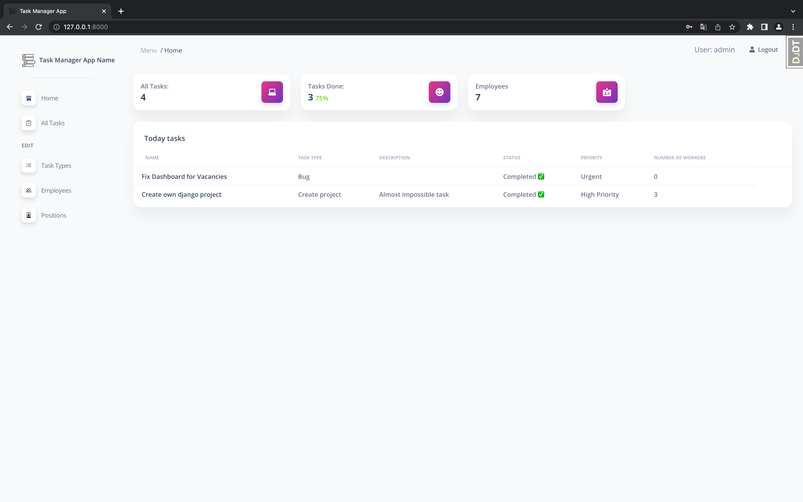

# Task Manager Django Project

**Django** project where implemented back-end logic with `Django Framework` and front-end part using `Bootstrap 5`

# Check it out!
[Task manager App project deployed to Render](https://task-manager-app-h743.onrender.com)

## Manual Build
> 👉 Install modules via `VENV`  

```bash
$ virtualenv venv
$ venv\Scripts\activate (on Windows)
$ source venv/bin/activate (on Mac)
$ pip install -r requirements.txt
```

<br />

> 👉 Set Up Database

```bash
$ python manage.py makemigrations
$ python manage.py migrate
```
<br />

> 👉 Create superuser

```bash
$ python manage.py createsuperuser
```

<br />

> 👉 Start the app

```bash
$ python manage.py runserver
```

At this point, the app runs at `http://127.0.0.1:8000/`.

<br />

## Use such credentials to login and check functionality
* username: test_user
* password: 1qazcde3

## Features
* Assign yourself to task
* Mark tasks as done
* Your personal profile page with separated completed and uncompleted tasks

## DEMO

